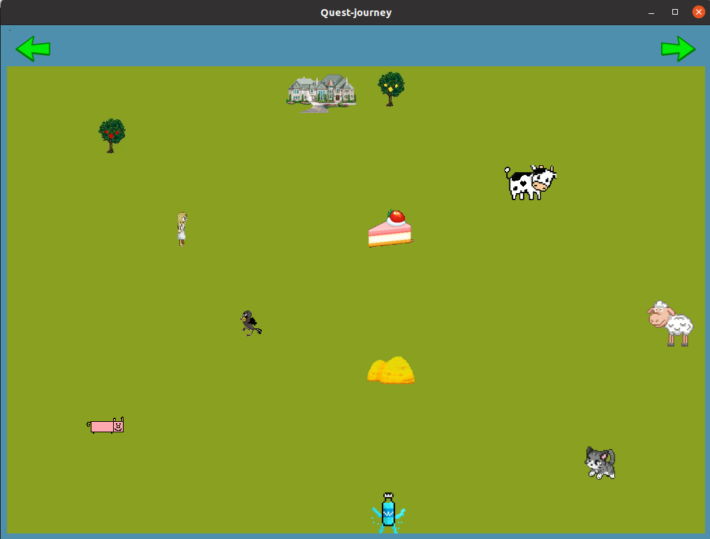
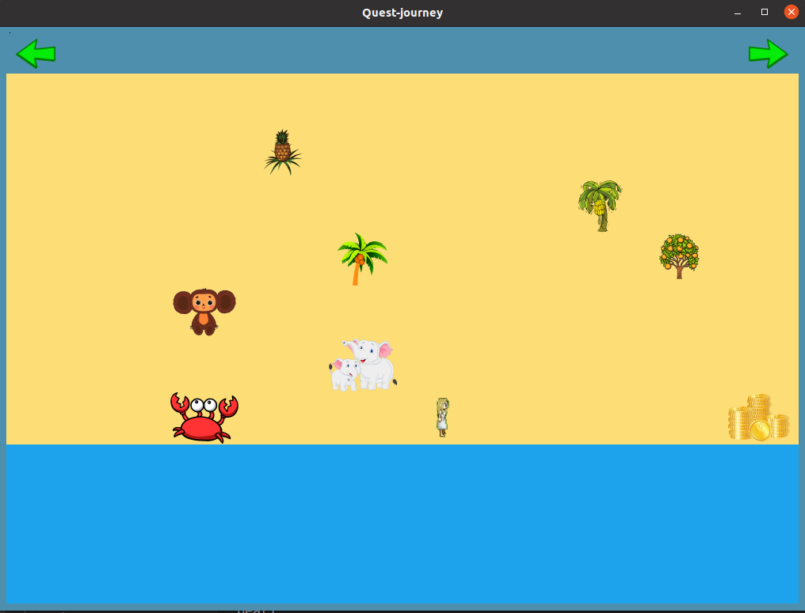
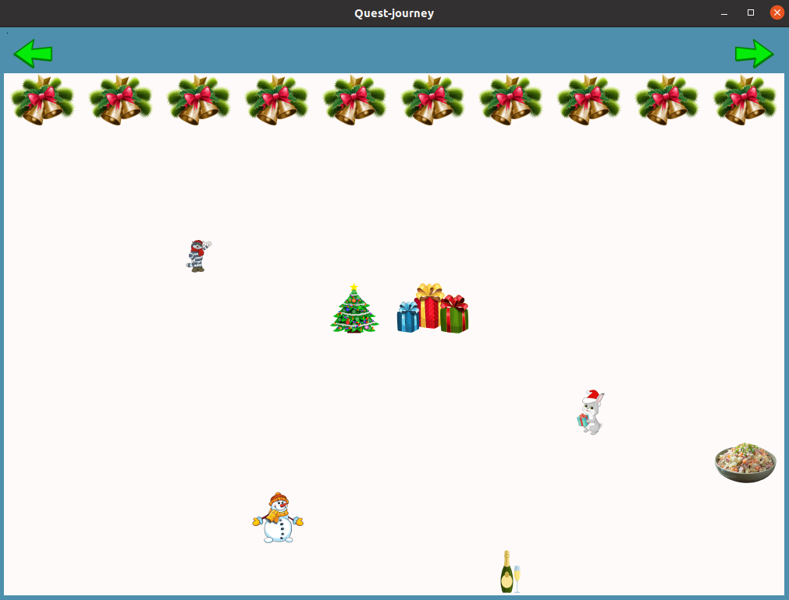

# Quest-journey

- `Python Qt6`
- to run `python3 main.py`

## Description
Квестовая игра с тремя локациями. На каждой локации есть взаимодействующие объекты.

- Летняя деревенская локация! Например, можно покорнить свинку.

- Пляж! Реакция краба на золотую монетку уникальна.

- Зима! Можно сыграть мелодию колокольчиками.

